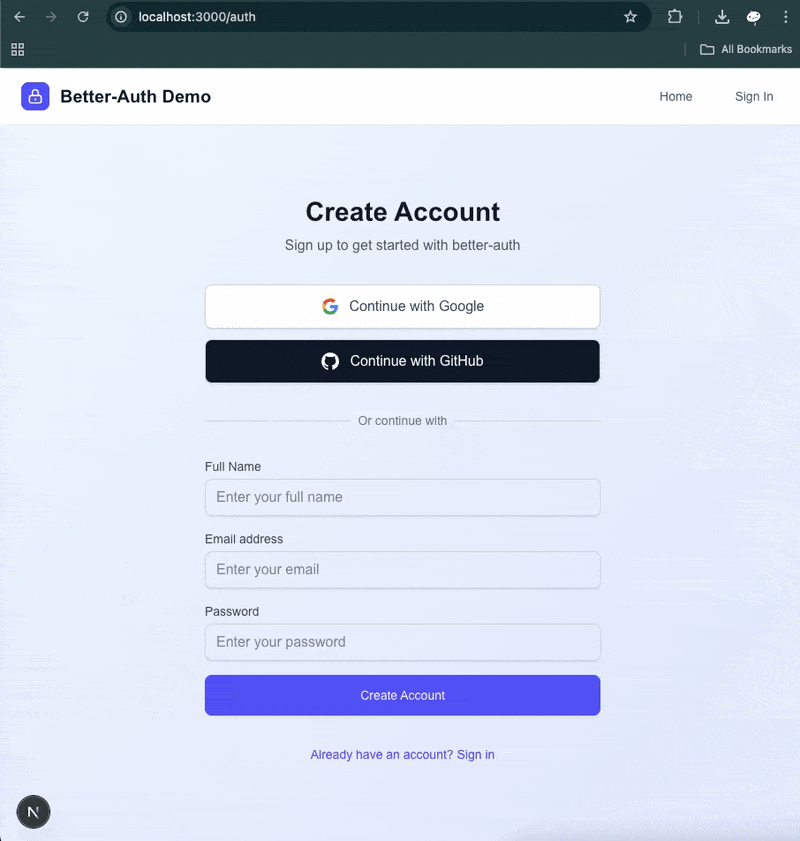
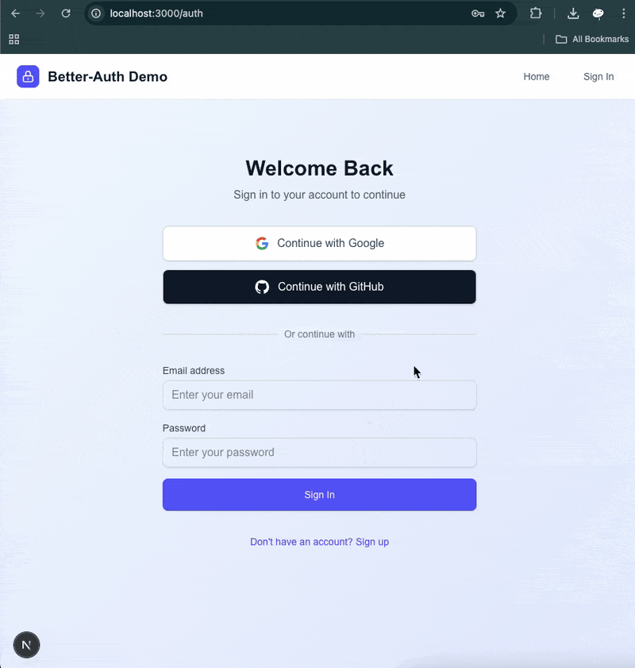
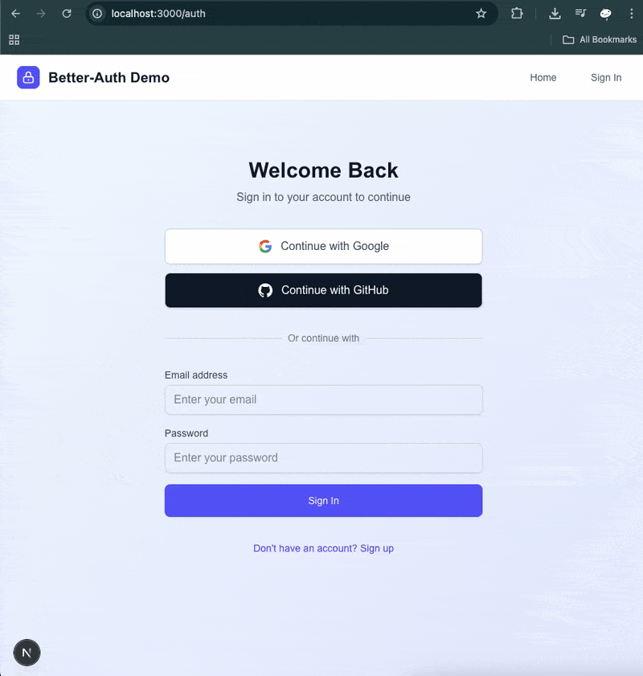
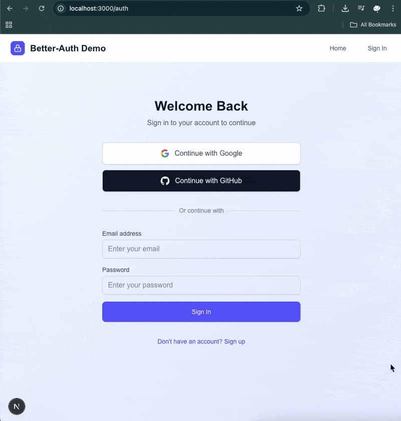

<h3 align="center">NextJS Authentication with Better Auth</h3>

## Table of Contents

1. [Introduction](#introduction)
2. [Note](#note)
3. [Demo](#demo)
4. [Tech Stack](#tech-stack)
5. [Features](#features)
6. [Quick Start](#quick-start)
7. [What I learned](#learn)

## <a name="introduction">Introduction</a>

Basic authentication with Email/Password and Social Login(Google and Github) using Better-Auth, and store the user's data in the database

## <a name="note">⚠️ Note</a>

This project was implemented based on a tutorial video on YouTube from PedroTech [NextJS Authentication Full Course 2025 | Learn Better Auth in 1 Hour](https://youtu.be/LMUsWY5alY0).

## <a name="demo">Demo</a>

Click on each section to toggle the demo image.

<details>
  <summary>
    Email/Password
  </summary>
  <b>Sign up</b>
  <div>
    <a href="">
        
    </a>
  </div>
  <b>Sign in</b>
  <div>
    <a href="">
      
    </a>
  </div>
</details>
<details>
  <summary>
    Google
  </summary>
  <div>
    <div>
      <a href="">
        
      </a>
    </div>
  </div>
</details>

<details>
  <summary>
    Github
  </summary>
  <div>
    <div>
      <a href="">
        
      </a>
    </div>
  </div>
</details>

## <a name="tech-stack">Tech Stack</a>

- Next.js - React framework for full-stack web application development
- React - JavaScript library
- TypeScript - JavaScript superset for type safety
- Better Auth – Authentication library
- Neon - Cloud `PostgreSQL` database
- Prisma – ORM for `PostgreSQL`
- Tailwind CSS v4 - CSS framework
- Vercel - Cloud platform to host this project

## <a name="features">Features</a>

- Email/Password Authentication
- Google and GitHub OAuth integration
- Complete user profile and session handling
- Secure session handling with cookies

## <a name="quick-start">Quick Start</a>

Follow these steps to set up the project locally on your machine.

### Prerequisites

- Git
- Node.js
- npm

### Cloning the Repository

```bash
git clone https://github.com/bank8426/nextjs-better-auth.git
cd nextjs-better-auth
```

### Installation

Install the project dependencies using npm:

```bash
npm install
```

### Set Up Environment Variables

1. Create a new file named `.env.local` and copy the content inside `.env.example`
2. Replace the placeholder values with your actual credentials

```env
# https://www.better-auth.com/docs/installation - generate from step 2
BETTER_AUTH_SECRET=
BETTER_AUTH_URL=http://localhost:3000

# https://github.com/settings/developers - create a new OAuth Apps
GITHUB_CLIENT_ID=
GITHUB_CLIENT_SECRET=

# https://console.cloud.google.com/auth/clients - create a new OAuth Client
GOOGLE_CLIENT_ID=
GOOGLE_CLIENT_SECRET=


# https://console.neon.tech/ - create a new database and get the Connection string
DATABASE_URL=
```

### Database Setup

1. **Create your PostgreSQL database** (locally or using a cloud provider(e.g. neon))

2. Create a new file named `.env`
3. Replace the placeholder values with your actual credentials

```env
# https://console.neon.tech/ - create a new database and get the Connection string
DATABASE_URL=
```

4. **Run Prisma migrations:**

```bash
npx prisma migrate dev --name init
```

5. **Generate Prisma client:**

```bash
npx prisma generate
```

### Running the Project

```bash
npm run dev
```

Your server will run on [http://localhost:3000](http://localhost:3000/)

## <a name="learn">What I learned</a>

- `Better Auth` - It provides functionality like `Auth.js` but without UI. The configuration seems to be easier than `Auth.js` since you can give the `database` and `adapter` that you use, and it will handle user information and session management for you (just need to add `nextCookies` as a plugin). It also works well with `Prisma` and `PostgreSQL` since Prisma can generate the schema for you.
